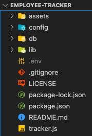

# Employee Tracker  

## Project overview

This application allows the ability to view, manage, and make modifications to staffing structure for organizations/businesses, otherwise known as C.M.S - Content Management Systems. Using the command line, users can choose options through prompts to manipulate a databse.

### Project Status:

This project is completed and functional.

#### Issues to debug:
* providing a "Quit" option but application doesn't actually exit?
* `updateManager`: pulled employees that are managers to provide user options BUT
    - picking one option sends back an ERROR message
    - picking the other option will follow through with the function but manager will fill in as NULL in database
    - **THIS WAS A BONUS FUNCTION FOR THE ASSIGNMENT**

:: ALL ISSUES RESOLVED ::

****

## MVP

### Project-build Aspects:

The following components are used to build the code for this project:

1. Javascript
    * class constructor to hold queries
2. Node > npm:
    * InquirerJs *default package*
    * console.table
    * util *default package*
    * dotenv
3. MySQL (npm package)
    * MySQLWorkbench

### Functionality:

The following lists all functions within this project:

* VIEW all three database tables: "employee", "roles", "department"
    - **BONUS** user can view employees by manager
    - **BONUS** user can see total budget of each department
* UPDATE "employee" database table
    - **BONUS** user can update BOTH role and *manager*
* ADD to all three database tables
* **BONUS** DELETE from all three database tables

### Process:
* directory structure created: please see [Installation](#Installation) section
* `npm init` ran to create package.json file
* required packages installed as dependencies
* depended ***HEAVILY*** on class activities, [MySQL Documentation](https://dev.mysql.com/doc/refman/8.0/en/), [MySQLTutorial](https://www.mysqltutorial.org/basic-mysql-tutorial.aspx), and several different documentation/tutorials/videos on promises/async-await as resources
* MySQLWorkbench used to check queries that are used in `queries.js`

****

## Installation

1. Clone this repository onto local workspace
2. Open Terminal (MacOS) or Git Bash (Windows) and change location to where you want the cloned directory
3. Type `git clone` and paste copied respository
4. Directory should include the following:

***5. IMPORTANT >>>
    - rename `.env.EXAMPLE` to `.env`
    - change "//YOUR SQL PASSWORD HERE//" to your own sql password***

## Usage

If accessing application from source code - RUN WITH CLI:

FIRST >>  `npm init`

SECOND >> `npm start`

## Walkthrough Video

****

## License

This applications is licensed under MIT - please refer to the included `LICENSE` file in this repo.

## Credit

* Full-stack Bootcamp Program @ [Washington University, Saint Louis](https://bootcamp.tlcenter.wustl.edu/) through [© 2021 Trilogy Education Services, LLC, a 2U, Inc. brand](https://www.trilogyed.com/)
* Walkthrough video via [@ 2021 Zoom Video Communications, Inc](https://zoom.us/)